# 批次依赖图（BATCH DEPENDENCY GRAPH）

> M0 历史完整保留；MVP 的新机器权威为
> [registry/batch-graph.json](registry/batch-graph.json)。全局串行批次依赖；
> 规则：活跃施工时 `GLOBAL_WIP = 1`、空闲等待时 `GLOBAL_WIP = 0`，一个批次只修改一个权威仓库、前一批次正式关闭后才可启动下一批次、
> 集成任务只读两个来源 Commit。

## 串行批次表

| 顺序 | 批次 | 仓库 | 目的 | 风险 |
|---|---|---|---|---|
| 1 | `AIPT-M0-B000` | AIPT | 权威入口、MIT、决策登记、设计文档安装 | governance |
| 2 | `AIPT-M0-B001` | AIPT | Go/pnpm 工具链、公共 CI、供应链基础；追溯验证 B000 | supply-chain |
| 3 | `AIPT-M0-B002` | AIPT | Schema、JSON-RPC、Adapter SDK、最小协议夹具合同 | protocol |
| 4 | `UNREGISTERED-AIPT-P0-B000` | UNREGISTERED | 正式名称、内容许可、预制角色 v2 | licensing |
| 5 | `UNREGISTERED-AIPT-P0-B001` | UNREGISTERED | AIPT 输入清单、稳定 ID、可见性与 SafetyProfile | visibility |
| 6 | `AIPT-M0-B003` | AIPT | PostgreSQL、迁移与事件账本骨架 | authoritative-state |
| 7 | `AIPT-M0-B004` | AIPT | Launcher 与 Core 空壳 | runtime |
| 8 | `AIPT-M0-B005` | AIPT | Harness Adapter、stdio Smoke、最小协议夹具运行 | harness-integration |
| 9 | `AIPT-M0-B006` | AIPT | Evidence/Audit Schema 与最小证据导出 | evidence-integrity |
| 10 | `UNREGISTERED-AIPT-P0-B002` | UNREGISTERED | 机器规则、Rule ID 映射、关键语义图 | rules-canon |
| 11 | `UNREGISTERED-AIPT-P0-B003` | UNREGISTERED | 游戏适配器、三个 Mutant、真人指南协议映射 | game-adapter |
| 12 | `AIPT-M0-B007` | AIPT | 最小 Web UI、队列视图、报告入口 | ui |
| 13 | `INT-AIPT-UNREGISTERED-001` | INTEGRATION_READ_ONLY | 固定候选 Commit 对的只读 Schema/Adapter Smoke | cross-repository |
| 14 | `AIPT-M0-B008` | AIPT | M0 综合验收、GPT 开发态审计、M0 Development Pass | milestone-gate |

## 纯文本串行链

```text
AIPT-M0-B000
  → AIPT-M0-B001
  → AIPT-M0-B002
  → UNREGISTERED-AIPT-P0-B000
  → UNREGISTERED-AIPT-P0-B001
  → AIPT-M0-B003
  → AIPT-M0-B004
  → AIPT-M0-B005
  → AIPT-M0-B006
  → UNREGISTERED-AIPT-P0-B002
  → UNREGISTERED-AIPT-P0-B003
  → AIPT-M0-B007
  → INT-AIPT-UNREGISTERED-001（只读）
  → AIPT-M0-B008
```

## MVP 权威串行批次表

下表严格对应机器权威 `aipt.public.mvp-batch-graph/v1`；顺序、ID、仓库、目的与风险不得重命名、重排、拆分或合并。

| 顺序 | 批次 | 仓库 | 目的 | 风险 |
|---|---|---|---|---|
| 1 | `AIPT-MVP-B000` | AIPT | MVP authority bootstrap, machine batch graph, lifecycle transition, validator foundation | governance |
| 2 | `AIPT-MVP-B001` | AIPT | Campaign/Suite/Case/Run contracts, immutable Run Manifest, PostgreSQL authoritative serial queue and lease skeleton | authoritative-state |
| 3 | `UNREGISTERED-AIPT-P1-B000` | UNREGISTERED | Freeze Task 0 executable playtest package contract, scene/guide/rule mapping and runtime adapter inputs | game-canon |
| 4 | `AIPT-MVP-B002` | AIPT | Deterministic Run Core: action transaction pipeline, RNG streams/seed commitments, invariants, projections and replay | state-projection |
| 5 | `AIPT-MVP-B003` | AIPT | 1 GM + 4 player Agent orchestration, per-Run sessions, persona/context assembly, visibility and bounded repair | hidden-information |
| 6 | `AIPT-MVP-B004` | AIPT | Versioned Model Profiles, real Harness runtime gateway, REMOTE_DEEPSEEK and LOCAL_LLAMACPP minimum certification | external-model-security |
| 7 | `INT-AIPT-UNREGISTERED-MVP-001` | INTEGRATION_READ_ONLY | Fixed-pair end-to-end Task 0 runtime conformance smoke without qualification-run claims | cross-repository |
| 8 | `AIPT-MVP-B005` | AIPT | Run evidence closure: AUDIT_READY generation, replay/defect/report contracts and deterministic export | evidence-integrity |
| 9 | `AIPT-MVP-B006` | AIPT | Operational loopback Web controls for Queue/Run/Status-Table/Reports using the same authoritative services | ui-security |
| 10 | `AIPT-MVP-B007` | AIPT | Non-qualifying real-model diagnostic pilot: DeepSeek full path plus llama.cpp startup/auth/minimum role call | external-model-pilot |
| 11 | `AIPT-MVP-B008` | AIPT | Five serial Clean qualification Runs on the fixed Task 0 pair | qualification-clean |
| 12 | `AIPT-MVP-B009` | AIPT | Three serial Mutant qualification Runs and mandatory detection of all frozen mutant classes | qualification-adversarial |
| 13 | `AIPT-MVP-B010` | AIPT | MVP comprehensive acceptance, replay/reachability/privacy review, GPT hard gate and MVP Development Pass | milestone-gate |

```text
AIPT-MVP-B000
  → AIPT-MVP-B001
  → UNREGISTERED-AIPT-P1-B000
  → AIPT-MVP-B002
  → AIPT-MVP-B003
  → AIPT-MVP-B004
  → INT-AIPT-UNREGISTERED-MVP-001（只读）
  → AIPT-MVP-B005
  → AIPT-MVP-B006
  → AIPT-MVP-B007
  → AIPT-MVP-B008
  → AIPT-MVP-B009
  → AIPT-MVP-B010
```

当前 `AIPT-MVP-B000 = MERGED_CLOSED`，`construction = IDLE_WAITING_NEXT_BATCH`、`current_batch = NO_ACTIVE_BATCH`、`GLOBAL_WIP = 0`。final Candidate `9a4d5e0ad09fbc9c3e13536d02cd131f992836f2`（tree `895ccfc569435c390a1aaeea566167a2d61a4de6`，CI `32869412683` success）由 implementation merge `1a26e023af1b56c057590a46de2f63c3b4220923` 精确集成，post-merge CI `32907168240` success；finding `AIPT-MVP-B000-POSTMERGE-LIFECYCLE-001` = `CLOSED`。B000 只完成 MVP 治理/bootstrap，没有 Run engine、真实模型 runtime 调用、真实桌测或 qualification Run。`M0 Development Pass = GRANTED` 继续有效，`MVP Development Pass = NOT_GRANTED`；production/release 仍为 `NOT_GRANTED`，human equivalence 仍为 `NOT_CLAIMED`，Platform Integration 仍为 `FROZEN_WAITING_M1_ENGINE` 且解冻未获授权。`AIPT-MVP-B001` 只是命名的下一串行批次，保持 `NOT_STARTED`、`NOT_AUTHORIZED`、未授权且未启动；其余 MVP 批次全部 `NOT_STARTED`。不存在独立的 `AIPT-M1-*` 别名。

## Mermaid 视图（可选渲染）

```mermaid
flowchart LR
    B000["AIPT-M0-B000<br/>AIPT"] --> B001["AIPT-M0-B001<br/>AIPT"] --> B002["AIPT-M0-B002<br/>AIPT"]
    B002 --> P0A["UNREGISTERED-AIPT-P0-B000<br/>UNREGISTERED"] --> P0B["UNREGISTERED-AIPT-P0-B001<br/>UNREGISTERED"]
    P0B --> B003["AIPT-M0-B003<br/>AIPT"] --> B004["AIPT-M0-B004<br/>AIPT"] --> B005["AIPT-M0-B005<br/>AIPT"] --> B006["AIPT-M0-B006<br/>AIPT"]
    B006 --> P0C["UNREGISTERED-AIPT-P0-B002<br/>UNREGISTERED"] --> P0D["UNREGISTERED-AIPT-P0-B003<br/>UNREGISTERED"]
    P0D --> B007["AIPT-M0-B007<br/>AIPT"] --> INT["INT-AIPT-UNREGISTERED-001<br/>只读"] --> B008["AIPT-M0-B008<br/>AIPT"]
```



## 施工纪律

- `GLOBAL_WIP <= 1`（`R12-Q017`、`R13-Q003`）：活跃施工精确为 1，关闭后空闲等待精确为 0；任何时刻最多只有一个活跃批次。
- **单批次单仓库**（`R13-Q002`）：一个实施批次只能修改一个权威仓库。
- **前一批次正式关闭后才可启动下一批次**。
- **集成任务只读**（`INT-AIPT-UNREGISTERED-001`）：只读两个来源 Commit，不修改任一仓库。
- **MVP 集成任务只读**（`INT-AIPT-UNREGISTERED-MVP-001`）：只读固定来源 Commit 对，不修改任一仓库。
- **资格 Run 串行**：Clean 与 Mutant 资格 Run 只允许依照权威图串行执行；B000 不执行任何资格 Run。

## B000 Bootstrap CI 例外与 B001 追溯义务

- `AIPT-M0-B000` 是唯一一次在公共 CI 尚不存在时关闭的 Bootstrap 批次（`BOOTSTRAP-Q001`）：
  以最终本地确定性验收 + GPT 审计关闭，**不创建 CI**。
- `AIPT-M0-B001` 建立无秘密公共 CI（`R12-Q019`）后，第一次 CI 必须**追溯验证** B000 的
  文档、JSON、链接与 MIT License。

## 相邻文档

- [README.md](README.md)（Authority Index） · [PROJECT_STATUS.md](PROJECT_STATUS.md) · [registry/decisions.json](registry/decisions.json) · [../milestones/M0.md](../milestones/M0.md) · [../milestones/MVP.md](../milestones/MVP.md)
- [返回仓库首页](../../README.md)
